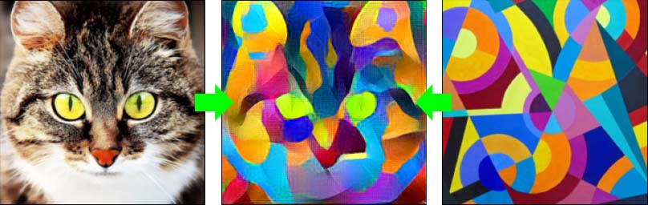
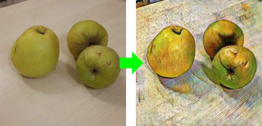
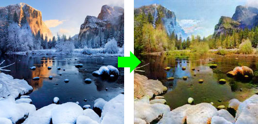

# Телеграм-бот для стилизации изображений

Бот предназначен для демонстрации применения нейронных сетей для стилизации изображений.

Предусмотрены следующие варианты стилизации:
1. Алгоритм постепенного переноса стиля с примением нейронной сети VGG16 и матрицы Грама. 
В этом алгоритме на вход подается изображение (контент), которое будет преобразовано
в соответствии со стилем второго изображения. Работает медленно.
Плюс алгоритма в том, что можно применить любой стиль, который определяется из второго изображения.


2. Преобразование к стилю художника Ван Гога. Используется предобученная в UC Berkeley
нейронная сеть cycle GAN.


3. Преобразование зимнего пейзажа к летнему. Также используется сеть CGAN, предобученная в UC Berkeley.


## Особенности работы:

Изображения уменьшаются и обрезаются до размера 244*244, это позволяет быстро выдавать результат
и не требует много памяти.
Бот построен на асинхронной архитектуре с помощью библиотеки aiogram.
Предусмотрено одновременное подключение разных пользователей и отслеживание состояния диалога
с каждым пользователем.
Секретный токен бота передается через переменную окружения TG_BOT_TOKEN

## Cycle GAN

За основу был взят код [pytorch-CycleGAN-and-pix2pix](https://github.com/junyanz/pytorch-CycleGAN-and-pix2pix)
Некоторые функции и настройки запуска были изменены так, чтобы сеть принимала изображение,
обрабатывала его генератором и выдавала результат.

Предварительно скачаны веса предобученных моделей style_vangogh.pth  и winter2summer_yosemite.pth из [хранилища](http://efrosgans.eecs.berkeley.edu/cyclegan/pretrained_models/)
 в transform_models\cycleGAN\checkpoints\

Подготовка весов для работы бота производится с помощью 
вспомогательного скрипта transform_models\cycleGAN\prepare_model.py внутри которого 
указывается имена файлов скачанных моделей
Подготовленные для использования ботом веса сохраняются скриптом в 
transform_models\pth\

## Необходимо доработать

* обработку входящего изображения в виде файла
* отделить длительную обработку изображения в отдельный поток, чтобы бот не зависал на долго
* добавить настройки количества шагов для "медленного" алгоритма переноса стиля
* добавить вывод промежуточных изображений для "медленного" алгоритма, т.к. часто они бывают довольно интересными
* корректную остановку работу бота и очистку памяти и диска от сохраненных данных

## Запуск
```
python app.py
```

## Сборка и запуск docker контейнера
```
docker build --build-arg TG_BOT_TOKEN="ТОКЕН_ВАШЕГО_БОТА" . -t style_bot
```
В таком случае токен будет сохранен в контейнере.
Можно также при сборке не указывать токен, а передавать его при запуске контейнера:
```
docker run --name style_bot -d --rm -e TG_BOT_TOKEN="ТОКЕН_ВАШЕГО_БОТА" style_bot
```

## requirements.txt

Используются следующие библиотеки:
```
aiogram==3.3.0
matplotlib
numpy
Pillow
torch
torchvision
typing_extensions
```


## Репозиторий содержит:

| | Описание файлов и папок |
| --- | --- |
| app.py | основной цикл программы, "точка входа"|
| Dockerfile | скрипт сборки докер контейнера |
| requirements.txt | необходимые библиотеки |
| handlers\default_commands.py | обработчики основных команд бота |
| handlers\dialog.py | обработчики диалога |
| images\ | изображения для документации |
| keyboards\start_keyboard.py | основное меню (клавиатура бота) |
| transform_models\cycleGAN.py | класс для преобразований через cycle GAN |
| transform_models\style_transfer_gram.py | реализация преобразования с использованием VGG16 и матрицы Грама |
| transform_models\cycleGAN\prepare_model.py | вспомогательный скрипт для подготовки весов моделей |
| transform_models\cycleGAN\checkpoints\ | Веса предобученных моделей UC Berkeley |
| transform_models\cycleGAN\models\ | архитектура сети для предобученной cycleGAN |
| transform_models\cycleGAN\options\ | вспомогательные процедуры для запуска скрипта подготовки моделей |
| transform_models\pth\ | подготовленные с помощью prepare_model.py веса моделей, которые использует в работе бот |

## Ссылки

Для работы cycleGAN был взят код из работы  Jun-Yan Zhu и Taesung Park [pytorch-CycleGAN-and-pix2pix](https://github.com/junyanz/pytorch-CycleGAN-and-pix2pix) .
Веса предобученных моделей cycleGAN были скачаны из открытого хранилища, связанного с этой работой.

В освоении aiogram очень помог обучающий курс MasterGroosha [Пишем Telegram-ботов с aiogram 3.x](https://mastergroosha.github.io/aiogram-3-guide/quickstart/)
